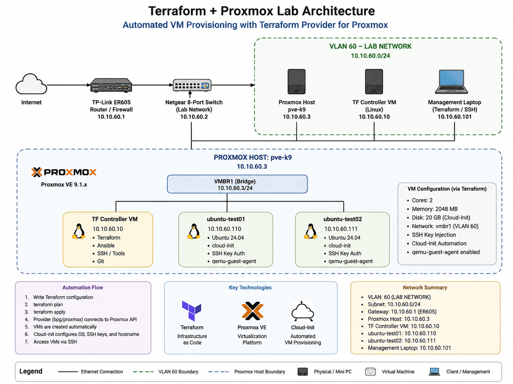
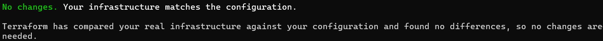
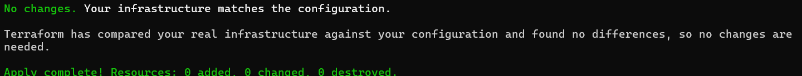
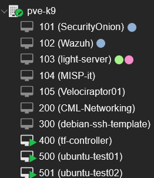
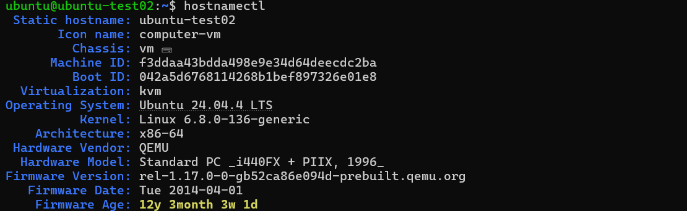

# Terraform Proxmox Infrastructure as Code

> Production-style Infrastructure as Code (IaC) project using Terraform to automate Ubuntu virtual machine deployments on a Proxmox Virtual Environment.

---

# Project Overview

This project demonstrates Infrastructure as Code (IaC) principles by provisioning and managing Ubuntu virtual machines on Proxmox VE using Terraform.

The objective is to eliminate manual virtual machine deployment by defining the complete infrastructure as code, allowing deployments to be repeatable, version controlled, and idempotent.

Current features include:

- Modular Terraform architecture
- Reusable VM module
- Cloud-Init provisioning
- SSH key injection
- Multiple VM deployment using `for_each`
- Per-VM CPU, memory and disk customization
- Power state management
- Git version control
- Version tagging

---

# Technologies

| Technology | Purpose |
|------------|---------|
| Terraform | Infrastructure as Code |
| Proxmox VE 9 | Virtualization Platform |
| Cloud-Init | Guest Initialization |
| Ubuntu 24.04 LTS | Virtual Machine Template |
| Git | Version Control |
| SSH | Secure Administration |
| Ubuntu Server | Terraform Controller |
| Proxmox API | Infrastructure Automation |

---

# Architecture

```
                    +-----------------------+
                    |  Terraform Controller |
                    | Ubuntu Server 24.04   |
                    +-----------+-----------+
                                |
                        terraform apply
                                |
                                ▼
                   +-------------------------+
                   |    Proxmox VE Host      |
                   |        pve-k9           |
                   +-----------+-------------+
                               |
         +---------------------+----------------------+
         |                                            |
         ▼                                            ▼
 +-------------------+                     +-------------------+
 | ubuntu-test01     |                     | ubuntu-test02     |
 | VMID 500          |                     | VMID 501          |
 | Ubuntu 24.04      |                     | Ubuntu 24.04      |
 +-------------------+                     +-------------------+
```

---

# Repository Structure

```
terraform-proxmox/
│
├── environments/
├── main.tf
├── modules/
├── outputs.tf
├── providers.tf
├── README.md
├── scripts/
├── terraform.tfvars
├── variables.tf
└── versions.tf
```

---

# Features

## Modular Design

Virtual machines are deployed using a reusable Terraform module.

## Multiple VM Deployment

Terraform deploys multiple VMs using:

```hcl
for_each = local.ubuntu_vms
```

instead of duplicated resource blocks.

---

## Cloud-Init

Each VM is automatically configured with:

- hostname
- Ubuntu user
- SSH public keys
- networking
- DNS configuration

---

## Per-VM Configuration

Each VM can define independently:

- VM ID
- hostname
- CPU cores
- memory
- disk size
- IP configuration
- power state

---

## Infrastructure State

Terraform maintains infrastructure state, ensuring the deployed environment matches the desired configuration.

Example:

```
No changes.
Your infrastructure matches the configuration.
```

---

# Deployment Workflow

```bash
terraform init

terraform validate

terraform plan

terraform apply
```

---

# Screenshots

## Architecture



## Terraform Plan



## Terraform Apply



## Proxmox Virtual Machines



## SSH Validation



---

# Version History

| Version | Description |
|----------|-------------|
| v0.1.0 | Initial reusable module |
| v0.2.0 | Refactored using for_each |
| v0.3.0 | Added second Ubuntu VM |
| v0.4.0 | Per-VM resource and power configuration |

---

# Current Status

Current implementation includes:

- Reusable Terraform module architecture
- Automated Ubuntu 24.04 VM deployment
- Cloud-Init provisioning
- Parameterized VM configuration
- Multiple VM deployment using `for_each`
- SSH key injection
- Git version control with tagged releases
- Idempotent infrastructure (`terraform plan` reports no changes)

---

# Future Enhancements

Planned improvements include:

- Static IP assignment
- Dynamic outputs
- Ansible provisioning
- Remote Terraform state
- GitHub Actions CI/CD
- Secret management
- Additional reusable modules
- Production documentation

---

# Learning Objectives

This project demonstrates practical experience with:

- Infrastructure as Code
- Terraform Modules
- Cloud-Init
- Git version control
- Declarative Infrastructure
- Idempotent Deployments
- Proxmox Automation

---

# Author

**Edilberto Rodriguez**

Infrastructure Automation • Networking • Cybersecurity • Virtualization

Blue Team Level 1 (BTL1)

Building enterprise home lab environments focused on Infrastructure Automation, Cybersecurity, Systems Engineering, and Satellite Communications.

---

# License

This project is intended for educational and portfolio purposes.
